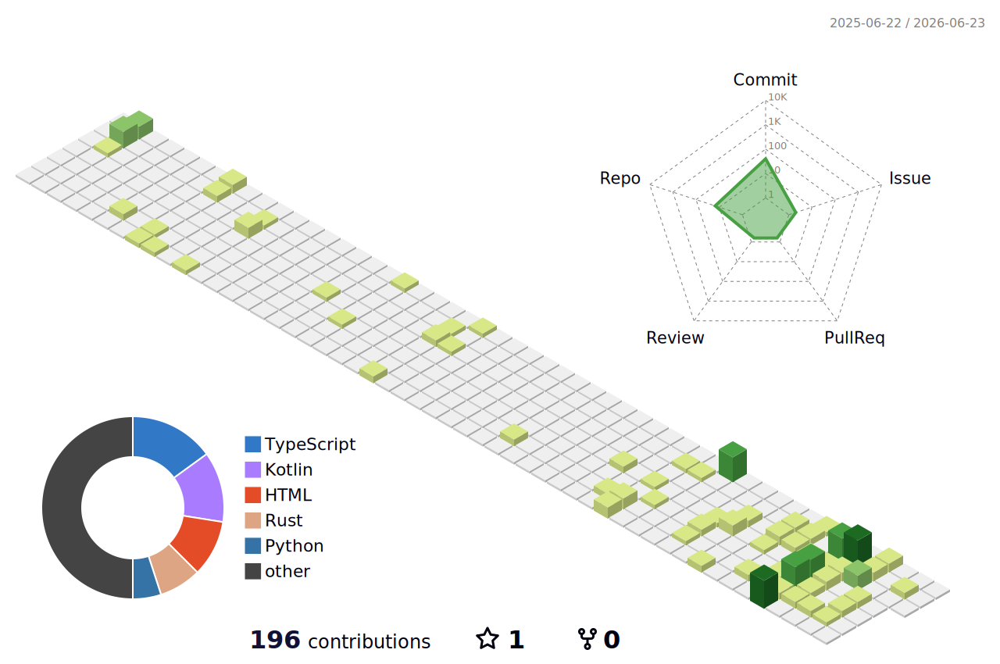

  

  
  

---

### 💻 About Me

- 🚀 Focused on building high-performance backend systems, custom network protocols, and automation tools.
- 🛠️ Daily stack: **Rust, Go, Python, and Node.js**.
- 🤖 Deeply interested in Edge AI infrastructure, LLM integrations, and system-level utilities.
- ⚡ Fun fact: I prefer terminal-centric workflows and robust, low-latency architectures.

---

### 🛠️ Tech Stack & Tools

  
  
  
  
  
  
  

---

### 📊 GitHub Analytics

  
  

 
### 🕋 My 3D Contribution Graph

  

  
<b>📈 Contribution Streak</b>

   
  

    
  

---

### 🤝 Connect with me

  
  

