



 

<a href="https://t.me/Funnyqe">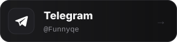</a> <a href="mailto:danilimatov4@gmail.com">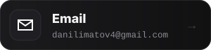</a> <a href="https://funny-iota-seven.vercel.app">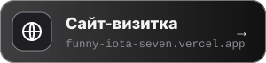</a>

 




  

<a href="https://github.com/FunnyNosok/FunnyGuard"></a>

  


<a href="https://zabeymsy-landing.vercel.app">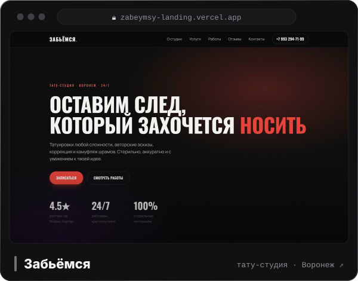</a>
<a href="https://mariya-nails-nu.vercel.app">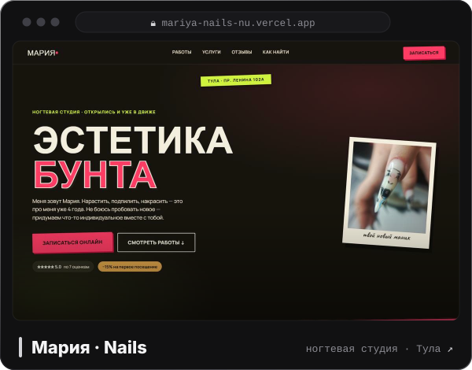</a>
<a href="https://onlytatoo.vercel.app">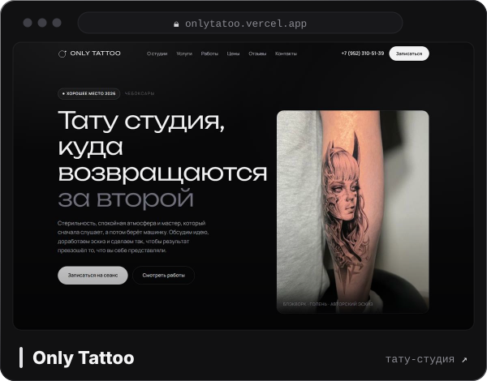</a>
<a href="https://hostel-ekb.vercel.app">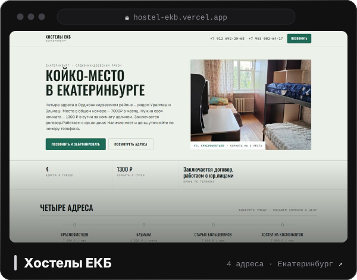</a>
<a href="https://hostel-sites-demo.vercel.app">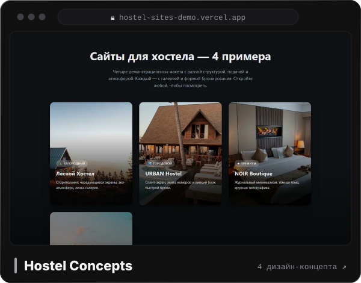</a>
<a href="https://t.me/Funnyqe"></a>

  


<a href="https://github.com/FunnyNosok/TGWSANDROID">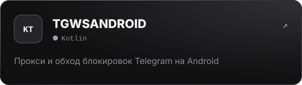</a>
<a href="https://github.com/FunnyNosok/GptTgBot">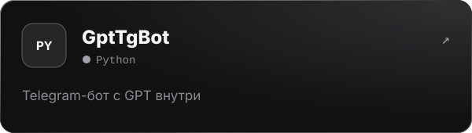</a>
<a href="https://github.com/FunnyNosok/Orion_Ai">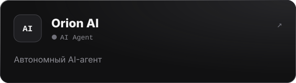</a>
<a href="https://github.com/FunnyNosok/Shooter">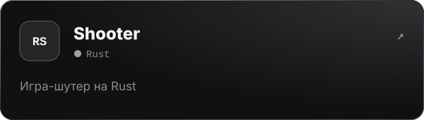</a>

  


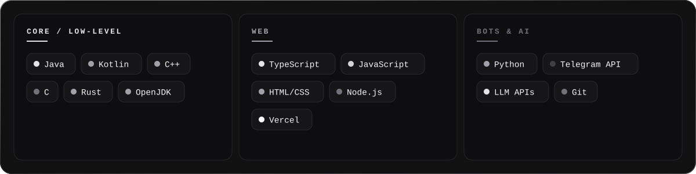

  


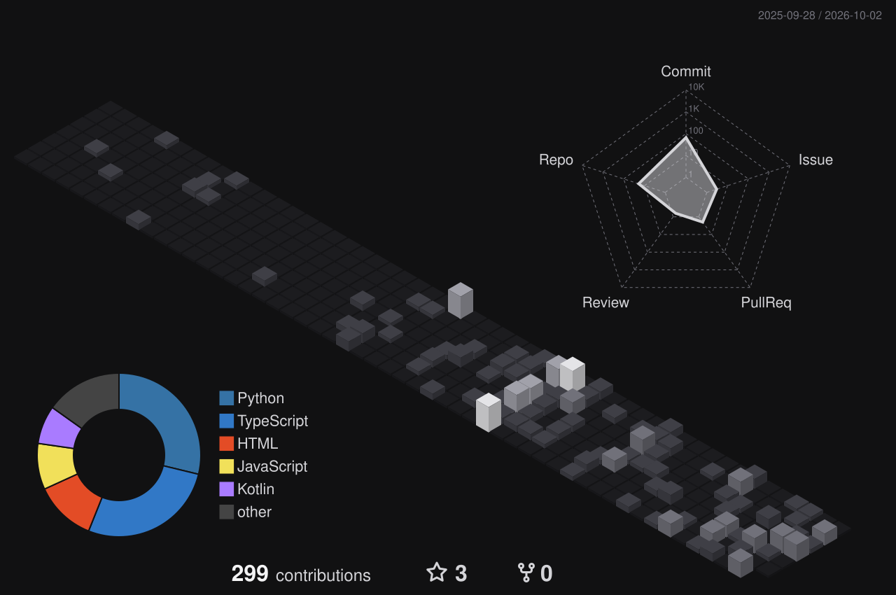

